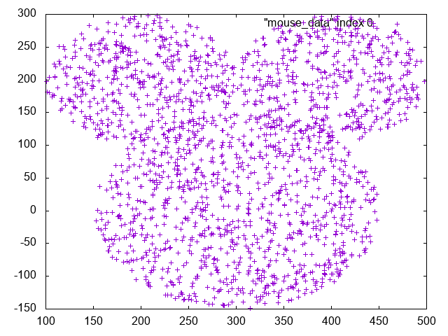
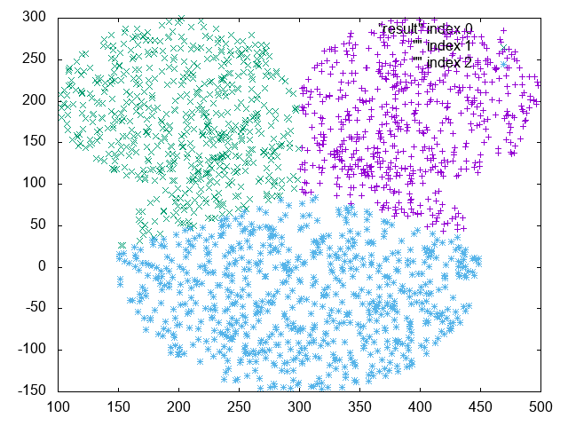

# C++ k-means-clustering-tool-set

The simple k-means clustering tool set.

## Requirements
* GCC 7.1.0 or later 
* Clang 4.0.0 or later
* Python 3.6.1 or later
* gnuplot 5.0 patchlevel 6

## Quick play
Clustring this plots.


```sh
git clone https://github.com/falgon/k-means-clustering-tool-set
cd sample && python3 random_circle.py # output mouse_data
```
By your favorite editor....
```cpp
// k_means.cpp
#include"../src/include/k_means.hpp"

int main()
{ 
    srook::k_mns::k_means km("mouse_data",3);
    km.clustering();
    
    const char* result_file="result";
    std::ofstream ofs(result_file);
    ofs<<km;

    using namespace std::string_literals;

    srook::k_mns::ploter pl("output.png");
    std::string cmd="plot \""s+std::string(result_file)+"\" index 0,\"\" index 1,\"\" index 2";

    try{
        pl.output(cmd.c_str());
    }catch(const std::runtime_error& exp){
        std::cerr<<exp.what()<<std::endl;
    }
}
```
And build
```cpp
g++ -std=c++1z -Wall -Wextra -pedantic k_means.cpp -o k_means.out
./k_means.out
```
output


## How to use

* Including src/include/k\_means.hpp
* [detail](https://gist.github.com/falgon/1575f5b7403a5321ee709dfbf01ea02e#file-k-means-cpp-L213-L233)

## LICENSE
[MIT LICENSE](LICENSE)
